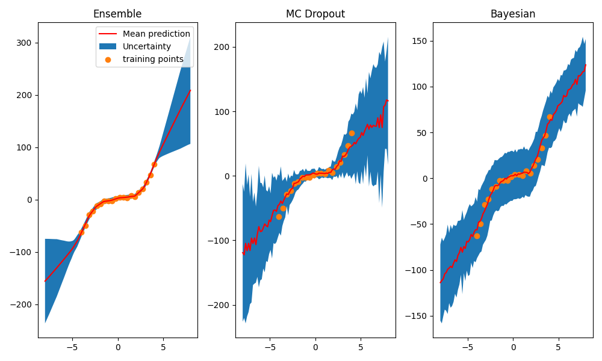

## Implementation for various methods for uncertainty quantification in deep learning, included the following methods

- MC dropout
- Bayesian neural network using variational inference
- deep ensemble learning

For usage, see example.py

## To Do : Make Bayesian NN for multiple output
